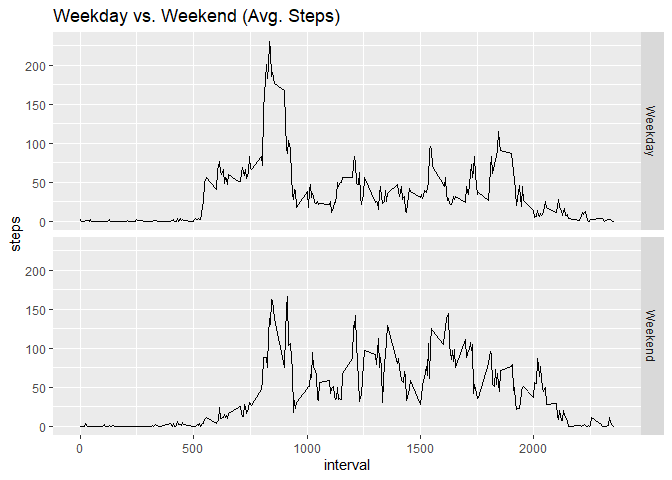

## Loading and preprocessing the data


```r
library(dplyr)
```

```
## 
## Attaching package: 'dplyr'
```

```
## The following objects are masked from 'package:stats':
## 
##     filter, lag
```

```
## The following objects are masked from 'package:base':
## 
##     intersect, setdiff, setequal, union
```

```r
unzip("activity.zip")
activitydata <- read.csv("activity.csv", sep = ",")
str(activitydata)
```

```
## 'data.frame':	17568 obs. of  3 variables:
##  $ steps   : int  NA NA NA NA NA NA NA NA NA NA ...
##  $ date    : chr  "2012-10-01" "2012-10-01" "2012-10-01" "2012-10-01" ...
##  $ interval: int  0 5 10 15 20 25 30 35 40 45 ...
```

```r
## We change the data format in the date variable to date


## we filter out NA values from the activitydata and assign the new data to activity
activitydata$date <- as.Date(activitydata$date)
activity <- activitydata %>% filter(complete.cases(activitydata))

head(activity)
```

```
##   steps       date interval
## 1     0 2012-10-02        0
## 2     0 2012-10-02        5
## 3     0 2012-10-02       10
## 4     0 2012-10-02       15
## 5     0 2012-10-02       20
## 6     0 2012-10-02       25
```

## What is mean total number of steps taken per day?

```r
##Total number of steps taken each day
totalsteps <- activity %>% group_by(date) %>% summarise(steps = sum(steps))
```

```
## `summarise()` ungrouping output (override with `.groups` argument)
```

```r
## Now we create the histogram based on the aggregated data
hist(totalsteps$steps, xlab = "Number of Steps", main = "Total Number of Steps Each Day", col = "light blue")
```

<!-- -->

```r
## The mean of total number of steps taken per day
mean(totalsteps$steps)
```

```
## [1] 10766.19
```

```r
## Median of total steps taken per day
median(totalsteps$steps)
```

```
## [1] 10765
```


## What is the average daily activity pattern?
First, we calculate average steps for each interval for all days

```r
avgsteps <- activity %>% group_by(interval) %>% 
  summarise(steps = mean(steps))
```

```
## `summarise()` ungrouping output (override with `.groups` argument)
```
We plot the number of steps per day


```r
plot(avgsteps$interval, avgsteps$steps, type = "l", xlab = "Interval", ylab = "Steps", main = "Average Daily Number of Steps by Interval")
```

<!-- -->
Interval with most average steps

```r
avgsteps[which.max(avgsteps$steps), 1]
```

```
## # A tibble: 1 x 1
##   interval
##      <int>
## 1      835
```


## Imputing missing values
calculate the total number of missing values in the original data (activitydata)

```r
sum(is.na(activitydata$steps))
```

```
## [1] 2304
```
The number of rows with NA is 2304

Create new dataset and replace missing value with mean steps of interval

```r
activityimputed <- activitydata %>%
                    group_by(interval) %>%
                    mutate(steps = replace(steps, is.na(steps), mean(steps, na.rm = TRUE)))
```

Calculate the total number of steps taken each day with the imputed data.

```r
totalstepsimputed <- activityimputed %>%
                      group_by(date) %>%
                      summarise(steps = sum(steps))
```

```
## `summarise()` ungrouping output (override with `.groups` argument)
```

```r
head(totalstepsimputed)
```

```
## # A tibble: 6 x 2
##   date        steps
##   <date>      <dbl>
## 1 2012-10-01 10766.
## 2 2012-10-02   126 
## 3 2012-10-03 11352 
## 4 2012-10-04 12116 
## 5 2012-10-05 13294 
## 6 2012-10-06 15420
```

```r
## Histogram for total number fo steps
hist(totalstepsimputed$steps, xlab = "Number of Steps", main = "Histogram of Total Number of Steps Each Day", col = 'light blue')
```

<!-- -->

The mean and median of the aggregated imputed data set


```r
mean (totalstepsimputed$steps)
```

```
## [1] 10766.19
```

```r
median(totalstepsimputed$steps)
```

```
## [1] 10766.19
```
Comparing the mean and median of the first part of the assignment


```r
mean(totalsteps$steps)
```

```
## [1] 10766.19
```

```r
median(totalsteps$steps)
```

```
## [1] 10765
```
The mean values between the two data sets are the same, but the median of the imputed data set (10766) is higher than the median of the first part of the assignment.
## Are there differences in activity patterns between weekdays and weekends?
Create a new factor variable in the dataset with two levels - "weekday" and "weekend" indicating indicating whether a given date is weekday or weekend day.

```r
activityimputed["day"] <- weekdays(activityimputed$date)
activityimputed$type_day <- ifelse(activityimputed$day == "Saturday" | activityimputed$day == "Sunday", "Weekend", "Weekday")

## Turn type_day into a factor class
activityimputed$type_day <- as.factor(activityimputed$type_day)
```
Make a panel plot containing a time series plot (i.e. type = “l”) of the 5-minute interval (x-axis) and the average number of steps taken, averaged across all weekday days or weekend days (y-axis). See the README file in the GitHub repository to see an example of what this plot should look like using simulated data.

```r
avgstepstypeday <- activityimputed %>%
                      group_by(type_day,interval) %>%
                      summarise(steps = mean(steps))
```

```
## `summarise()` regrouping output by 'type_day' (override with `.groups` argument)
```

```r
library(ggplot2)

ggplot(data = avgstepstypeday, aes(x = interval, y = steps))+
  facet_grid(type_day ~ .)+
  geom_line()+
  ggtitle("Weekday vs. Weekend (Avg. Steps)")
```

<!-- -->

## Conlusion
There are some differences in average steps between Weekdays and Weekends. During weekdays, the person is more active at the start of the day and less active during the day. Meanwhile, during weekends, the person is less active at start of the day and more active throughout the day.

This is probably because the person is commuting to work in the morning and less active during work hours (sitting at desk). During weekends, the person does not have to prepare for work and therefore less active in the mornings, but more active during the day as the person is off from work.
